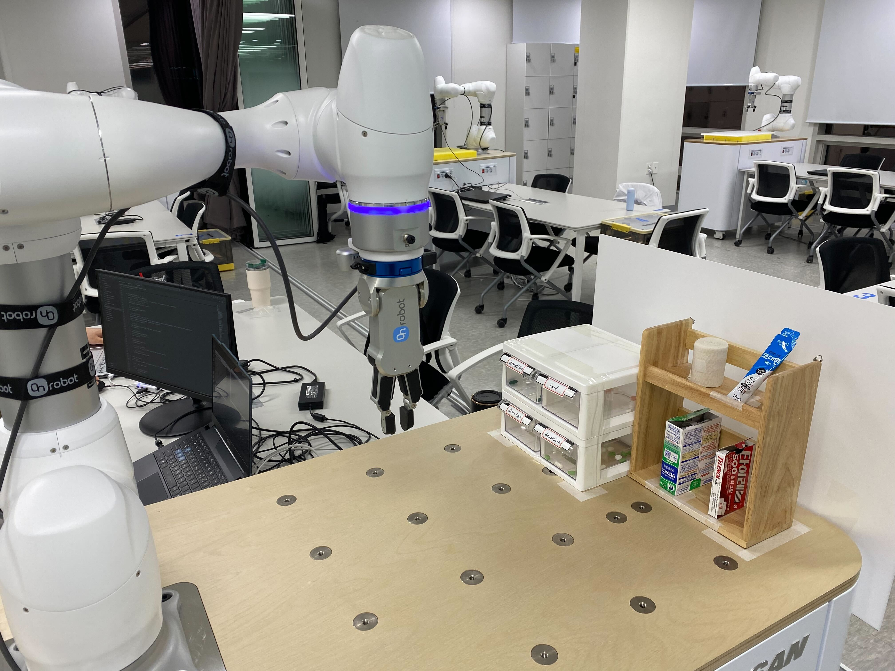

# 💊 RAAPS – AI 기반 협동로봇 약 조제 어시스턴트 시스템
## ROKEY B-1조 협동-2 Project
---

### 🔗 출처 및 라이선스

이 프로젝트는 **두산로보틱스(Doosan Robotics Inc.)**에서 배포한 ROS 2 패키지를 기반으로 합니다.  
해당 소스코드는 [BSD 3-Clause License](https://opensource.org/licenses/BSD-3-Clause)에 따라 공개되어 있으며,  
본 저장소 또한 동일한 라이선스를 따릅니다. 자세한 내용은 `LICENSE` 파일을 참고하시기 바랍니다.

> ⚠️ 본 저장소는 두산로보틱스의 공식 저장소가 아니며, 비공식적으로 일부 수정 및 구성을 포함하고 있습니다.  
> 공식 자료는 [두산로보틱스 공식 홈페이지](http://www.doosanrobotics.com/kr/)를 참고해 주세요.   
> github (https://github.com/DoosanRobotics/doosan-robot2)


## 1. 프로젝트 개요

**RAAPS (Rokey AI Automatic Pharmacy System)**는 사람의 생명과 직결된 **약 조제의 정확성과 안전성 확보**를 위해 개발된 **AI+로봇 기반 복약 보조 시스템**입니다.

### 개발 목적

- **약물 사고 예방**: 유사 약물 이름/포장, 비닐 삽입 오류 방지
- **약사 업무 부담 완화**: AI 음성 안내를 통해 증상 기반 일반약 추천 및 복용 설명
- **고령자/장애인 지원**: 스스로 복약이 어려운 사용자 대상 음성 안내 시스템 구축

### 작업 환경
</img> 


### 개발 환경
본 프로젝트는 Ubuntu 22.04 (ROS2 humble) 환경에서 개발되었습니다.   
&nbsp;

###  How to run

#### **robot control node**
code: [main_robot_control](rokey_project/rokey_project/main_robot_control.py)
```bash
ros2 run rokey_project main_robot_control
```

#### **vision**
code: [main_vision_realsense](rokey_project/rokey_project/main_vision_realsense.py)
```bash
ros2 run rokey_project main_vision_realsense
```

#### **AI speaker**
code: [ai_speaker](rokey_project/rokey_project/ai_speaker.py)
```bash
ros2 run rokey_project ai_speaker
```

#### **Ultrasound**
code: [dual_ultra](rokey_project/rokey_project/dual_ultra.py)
```bash
ros2 run rokey_project dual_ultra
```
&nbsp;
---

## 2. 팀 구성 및 역할

|이름|담당 업무|
|--|--|
|백홍하(팀장)|Vision(약 탐지, 좌표 추정), Robot 제어, ROS2 통신|
|서형원|Robot 제어(일반 의약품 전달)|
|정민섭|Voice(약 추천 및 설명), ROS2 통신, 초음파 센서 처리|
|정서윤|Vision(QR코드 인식, 약 탐지, 서랍 text 분류), 통합|

---

## 3. 프로젝트 구현 일정
**진행 일자: 25.5.26(월) ~ 25.6.5(목) (11일)**


---

## 4. SKILLS
### **Development Environment**
<div align=left>
  
  
  
</div>

[](https://skillicons.dev)

### **Robotics**
   
[](https://skillicons.dev)

### **Programming Languages**
   
[](https://skillicons.dev)

### **AI & Computer Vision**
<div align=left>
  
  
  
  
</div>

[](https://skillicons.dev) 


---
## 4. 시스템 구성 및 기능

### 하드웨어 구성
#### **Robot**
- Doosan Robotics m0609, OnRobot RG2 Gripper
#### **Vision Camera**
- Intel RealSense D435i
#### **SBC**
- Raspberrypi4 4gb
#### **Mic**
- Logitech HD Webcam C270
#### **Speaker**
- Blutooth speaker
#### **Sensor**
- HC-SRO4 Ultrasonic Sensor

### AI 비전 시스템
- **YOLOv11 기반 객체 탐지**  
  - 증상별 알약 구분
  - 일반 약품 구분
    
- **Segmentation**  
  - 알약의 pose 및 좌표 추정  

### 로봇 제어 시스템
- **rclpy 기반 ROS2 제어 패키지 구성**  
- **DDS 통신 기반 실시간 제어**  
- **Doosan ROS2 API 사용**

###  Voice AI 시스템

| 구성 | 사용 기술 |
|------|-----------|
| Wakeword 감지 | OpenWakeWord (TFLite) |
| 음성 인식 | Whisper-1 |
| 의미 분석/추천 | GPT-4o |
| 음성 출력 | Edge TTS (ko-KR-SunHiNeural) |

---

## 4.  주요 시나리오 및 동작 흐름

### 👨‍⚕️ 전문의약품 처리 흐름

1. 초음파로 사용자 감지
2. QR 코드 인식 자세로 이동 + "안녕하세요, 로키약국입니다" 음성 출력
3. QR 처방전 파싱 → JSON 변환 (이름, ATC코드, 투약 횟수 등)
4. 서랍 위치 인식 및 이동
5. YOLO Text 인식 → 해당 증상 좌표 추정
6. 서랍 열기 및 약 탐지
7. 약 포즈 계산(segmentation) → (x,y,θ)로 로봇 이동
8. 알약 집기 → 봉투 포장 위치로 이동
9. 약에 대한 설명 및 주의사항 설명

### 🩺 일반의약품 처리 흐름

1. 초음파로 사용자 감지
2. "hello rokey" 발화 → 증상 입력 (예: 머리 아파요)
3. GPT 분석 → 타이레놀/판콜A 추천
4. 사용자: "타이레놀 주세요"
5. 선반 인식 및 약 위치 추정
6. 로봇 이동 → 약 집기
7. 사용자 외력 감지 시 놓기
8. TTS로 약 설명

---

## 5. 💊 의약품 목록

- 전문의약품

| 증상       |  의약품 목록                                              |
|--------------|----------------------------------------------------------|
| 감기         | panstar_tab, amoxicle_tab                                |
| 피부염       | monodoxy_cap, ganakan_tab, sudafed_tab                   |
| 소화불량     | nexilen_tab, medilacsenteric_tab, magmil_tab             |
| 설사         | samsung_octylonium_tab, famodine, otilen_tab             |


- 일반의약품:  타이레놀, codawon_syrup, bandage, 파스

---

## 6. 시스템 아키텍처

### 노드 아키텍처


### 시스템 플로우
### 👨‍⚕️ 전문의약품 시스템 플로우


### 🩺 일반의약품 처리 흐름


---

## 7. 기대 효과 및 활용 방안

### 기대 효과
- 약물 사고 예방 → 의료 사고, 부작용 최소화
- 약사의 반복 업무 감소 → 고부가가치 업무 집중
- 팬데믹 대비 비대면 약국 운영 가능

### 활용 방안
- 약국 자동 조제 시스템  
- 병원 및 재택 의료 어시스턴트  
- 창고/서랍 물류 자동화  

---

## 8. 🎥 시연 영상

- 음성 명령 포함 ver
  
  [](https://youtu.be/1zJYaA5mdBo)


- 배속 ver
  
  [](https://youtu.be/hqsi3LKkr-4)


---

## 9. More about project

[▶️ PDF로 보기](https://drive.google.com/file/d/1z_QQFhGCjgT0Sqh8arpXodilGLL-YCai/preview)

[▶️ PPT로 보기](https://docs.google.com/presentation/d/19cP9Dc5Mcr3mRwFerbrN9vhR4jQqp0tBE7f35isZteA/edit?usp=drive_link/preview)


---
